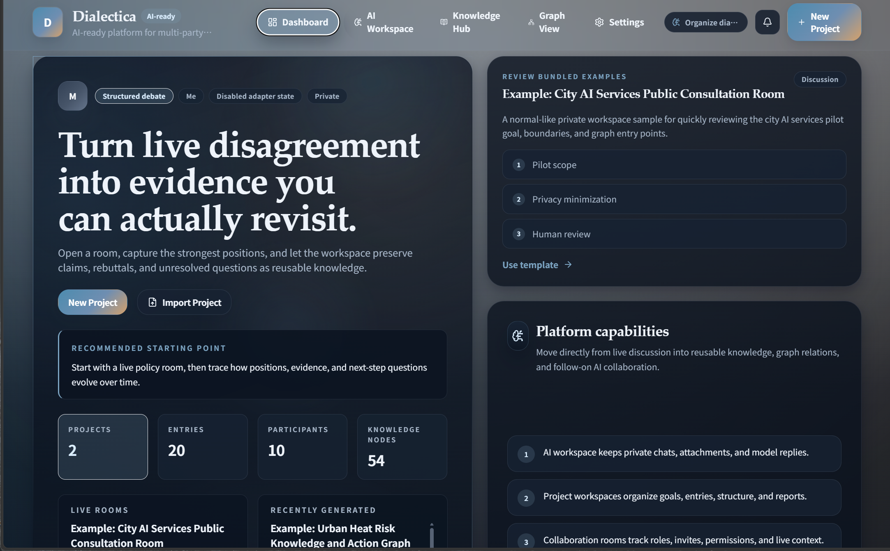
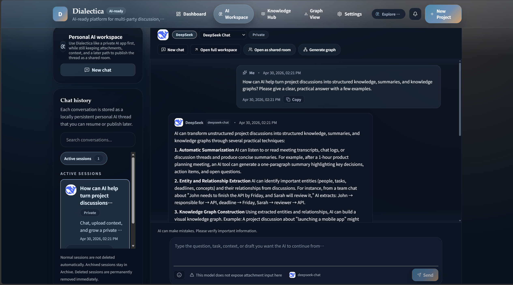
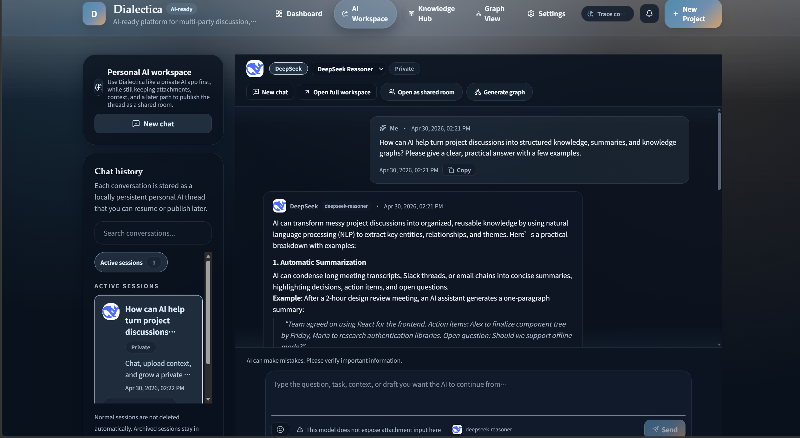
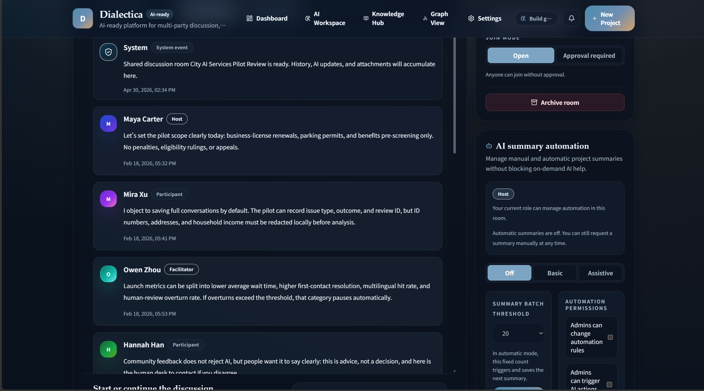
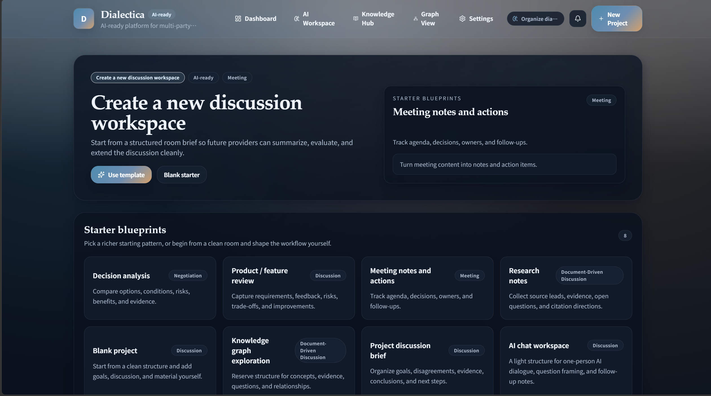
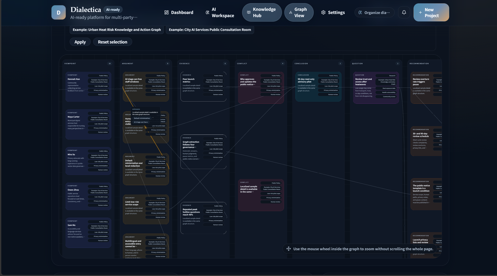
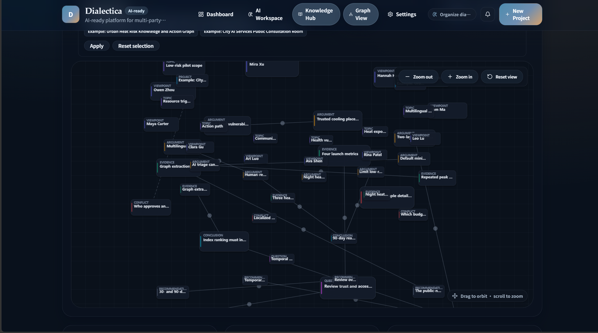
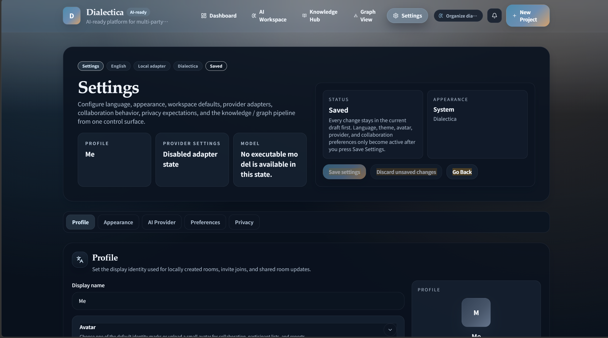
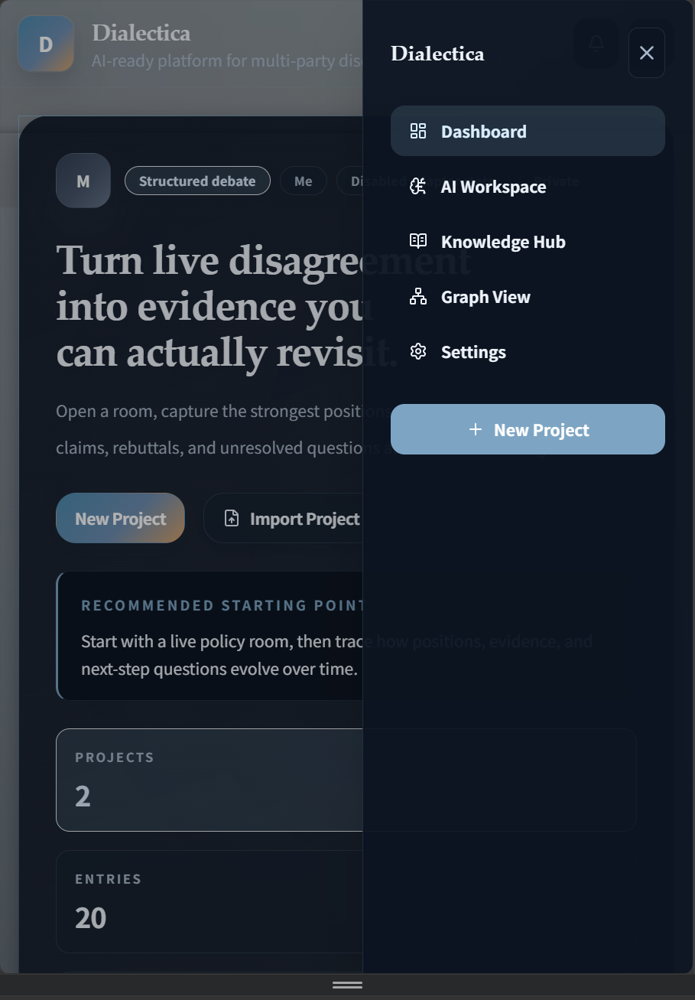

# Dialectica

> An independently developed personal V1 open-source reference implementation for exploring AI conversation, collaborative discussion, automatic / assistive summarization, and 2D / 3D knowledge graph workflows.

Dialectica is an open-source reference implementation for AI-assisted discussion, project collaboration, and knowledge capture.

It tries to address a common problem: after a large amount of chat, discussion, and AI replies happen, they often quickly become records that are hard to review, hard to organize, and hard to continue using. Valuable information is not necessarily absent; it is scattered across conversations, not structured, not summarized, and not turned into knowledge relationships that can be reused later.

Dialectica explores a workflow like this:

> Conversation and discussion → AI intervention → stage summary → knowledge nodes → relationship graph → project context that can continue to be tracked

It is not just an AI chat interface, and it is not a standalone knowledge graph viewer. It is closer to a runnable V1 architecture prototype that connects AI conversation, multi-party discussion, automatic / assistive summarization, Knowledge Hub, and 2D / 3D knowledge graphs inside one system.

## Why This Project Exists

In traditional chat tools, discussion usually exists as a message stream. Messages can be sent, replied to, and searched, but they rarely become structured knowledge in a natural way.

As AI gradually enters collaborative workflows, chat and discussion may no longer be only “instant communication between people.” AI can help organize, summarize, compare, and extract key points. It can also help make messy discussions easier to review, revisit, and structure.

The name Dialectica carries this meaning as well: discussion does not have to be a pile of messages. It can become a process that is organized, tracked, and reasoned about further.

This project does not try to prove that the future must take one particular shape. It provides a runnable reference implementation to show one possibility:

* AI can do more than answer a single question; it can also participate in organizing a discussion process.
* Multi-party discussion can go beyond chat history and become stage summaries and action signals.
* Project knowledge can go beyond scattered text and enter a Knowledge Hub.
* Viewpoints, risks, evidence, and decision paths in a discussion can be reorganized and reviewed through 2D / 3D graphs.
* Relationships between different projects or graphs can also be analyzed with AI assistance to form new structured perspectives.

In future collaboration software, chat tools, team knowledge bases, research tools, or AI-assisted workflows, similar capabilities may become increasingly important. Communication between users does not have to remain only a series of messages; it can also become a knowledge asset that can be summarized, linked, graphed, and reused.

Dialectica is a personal V1 attempt in this direction.

## Interface Preview

The screenshots below show the main interfaces and workflows in the current V1 version of Dialectica.

They are intended to illustrate the frontend structure, feature modules, and interaction direction of the project. The current version includes basic mobile adaptation, but the primary experience is still better suited to desktop use.

### Dashboard



### AI Workbench

AI Workbench shows regular conversation, model selection, and response behavior in different modes.





### Project Templates


### Collaboration Room



### Knowledge Hub



### Knowledge Graph





### Settings



### Mobile Navigation



## Current Capabilities

The current version includes a main workflow that is already connected end to end:

* AI Workbench: for regular AI conversation, model switching, and response version management.
* Project Workspace: for organizing discussion, goals, materials, and knowledge artifacts around a topic.
* Collaboration Room: for multi-party discussion, member management, permission boundaries, and room state records.
* Automatic summarization and assistive mode: for extracting key points, action items, risks, and unresolved questions from discussions.
* Latest AI intervention digest: for recording what AI did in a discussion, rather than simply stacking long text.
* Knowledge Hub: for aggregating knowledge nodes, topics, and graph entry points across projects.
* 2D / 3D knowledge graphs: for showing relationships between discussions, summaries, and knowledge.
* Cross-graph association analysis prototype: for exploring commonalities, differences, and association paths across multiple graphs.
* Multi AI Provider / Model settings: for connecting external models through the user’s own API keys.
* Six-language interface: English, Simplified Chinese, Japanese, Korean, French, and Russian.
* Local JSON persistence: for local-first project operation and experimentation.
* Bundled samples: for demonstrating project, collaboration, summarization, and graph workflows.

## Developer Quick Start

### Install and Run

```bash
npm install
npm run dev
```

Default development address:

```text
http://localhost:3000
```

Common checks:

```bash
npm run typecheck
npm test
npm run build
```

Other scripts that actually exist in the project can be checked in `package.json`. Do not document commands in the README that do not exist.

### Enable AI Features

Dialectica does not include a built-in AI model service.

Before using real AI features, users need to configure their own AI Provider, Model, and API Key. The main configuration entry point is the Settings page.

If the project supports server environment variables or local provider secret storage, describe that according to the real repository implementation. Do not commit API keys, tokens, provider secrets, `.env` files, or local runtime data to Git.

If a Provider is disabled, has no API Key, or has no executable model, features such as AI Workbench, summarization, and graph generation should show the corresponding unavailable state or failure message instead of generating fake results.

Regular knowledge graph generation and cross-graph association generation should also use the Provider / Model configured by the user.

## Project Structure

The main directories are:

```text
src/app
  Next.js pages and API routes.

src/components
  Main frontend component directory.

src/components/assistant
  AI Workbench, conversation UI, response revisions, and input interaction.

src/components/dashboard
  Home / Dashboard components.

src/components/knowledge
  Knowledge Hub, 2D / 3D graphs, graph versions, and graph view components.

src/components/projects
  Project Workspace, Collaboration Room, members, room settings, and automation-related components.

src/data
  Source-side bundled samples, demos, and static demonstration data.

src/lib
  Core business logic, data access, AI orchestration, Provider adapters, and utility functions.

src/lib/ai
  AI conversation construction, automatic summarization, assistive mode, and prompt boundary logic.

src/lib/knowledge
  Knowledge graph generation, graph budget, user graphs, graph versions, and graph service logic.

src/lib/providers
  AI Provider / Model call adapter layer.

src/locales
  Multilingual interface copy.

tests
  Unit tests and service-level tests.

scripts
  Build, check, and project utility scripts.

public
  Static assets.

docs/images
  README / GitHub showcase screenshots.

data
  Local runtime data directory. Real user data, API keys, provider secrets, and uploaded content should not be committed to a public repository.
```

`src/data` and `data` should not be confused: the former is source-side built-in data, while the latter is local runtime data.

## Local Data and Privacy Boundary

Dialectica uses a local-first data workflow. Runtime data is usually stored in the `data/` directory.

Important notes:

* `data/` is mainly used for local runtime data.
* `src/data` is used for built-in samples and source-side demo data.
* User runtime data should not be committed to a public repository.
* API keys, provider secrets, uploads, and real user content should not enter Git.
* `.env` or other files containing secrets should not be committed.
* The project does not provide cloud sync by default.
* Switching the interface language does not automatically translate user-created content.

## Current Status

Dialectica is an independently developed personal V1 open-source reference implementation.

It already has a fairly complete main feature chain, but it is not a fully polished hosted product and has not gone through extensive external user testing. Some UI details, mobile experience, graph interactions, edge cases, and deployment-level capabilities may still need further refinement.

The point of this project is not to claim that it has reached a final form. It is to provide an architecture starting point that can run, be studied, be modified, and be extended.

If you are interested in this direction, you are welcome to continue improving, extending, or redesigning it based on the existing code. Whether that means improving the frontend experience, fixing bugs, refining graph interactions, strengthening AI workflows, or reusing architectural ideas in another collaboration or knowledge system, it can help make this direction more complete.

Long-term maintenance and update cadence are not guaranteed.

## Project Boundaries

The current project should not be understood as a complete hosted application.

The following boundaries are important:

* The project does not include a built-in AI model service.
* AI capabilities depend on users configuring their own Provider, Model, and API Key.
* There is no real account system at the moment.
* Runtime data is mainly based on local JSON.
* There is no default cloud sync.
* There is no complete deployment monitoring, audit, queue, or backup and recovery system.
* Graph quality is affected by input content, context quality, and model capability.
* Some UI details, mobile details, and complex graph interactions still have room for continued refinement.

These boundaries describe the scope of the current V1, not a negation of the project’s value.

## Tech Stack

Main technologies:

* Next.js App Router
* React
* TypeScript
* Tailwind CSS
* Zod
* Zustand
* Lucide React
* Vitest
* Local JSON persistence
* Custom 2D / 3D knowledge graph views
* Multi-Provider AI call adapter layer

GitHub currently identifies this repository mainly as a TypeScript project, with small amounts of JavaScript and CSS.

## Possible Extension Directions

If the project continues to be extended, possible directions include:

* More complete export capabilities.
* Project backup and recovery.
* More complete local identity management.
* Graph layout presets.
* A more complete cross-graph analysis workflow.
* Browser-level end-to-end tests.
* Stronger deployment and operations support.
* More detailed mobile interaction refinements.

These directions are not required for the current V1 and do not constitute a maintenance commitment.

## License

This project uses the MIT License.

The repository includes an MIT `LICENSE` file. The `package.json` file also declares `"license": "MIT"`.

## Third-party Notice

Third-party AI Provider names, model names, trademarks, and logos belong to their respective owners.

Names appearing in this project are used only to identify configurable external services. They do not imply official affiliation, endorsement, or partnership with those service providers.
